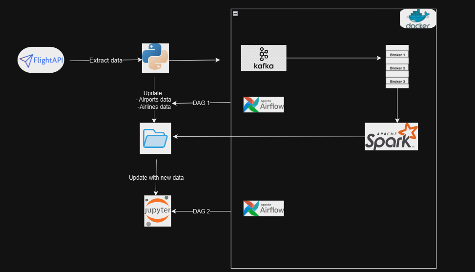

# Data-Engineering-Streaming-Project
## **Introduction: Building a Dynamic Data Engineering Project**

Create an ETL (Extract, Transform, Load) pipeline to process data from the flightradar24 API, which lists all flights, airports, and airlines worldwide.

In Python, this library: https://github.com/JeanExtreme002/FlightRadarAPI facilitates the use of the API

## **Solution schema 


## **Getting Started: Prerequisites and Setup**

For this project, we are leveraging a Gitlab repository that hosts our entire setup, making it easy for anyone to get started.

**a. Docker:**
Docker will be our primary tool to orchestrate and run various services.

- **Installation:** Visit Docker's official website to download and install Docker Desktop for your OS.
- **Verification:** Open a terminal or command prompt and execute `docker --version` to ensure a successful installation.

**b. Python:**
Python should be installed in version 3.9.3 in your OS


**c. Setting Up the Project:**

- **Clone the Repository:** First, you'll need to clone the project from its GitLab repository using the following command:

```
git clone <https://gitlab.com/exalt-it-dojo/candidats/madjid-korrabi-flight-radar-2d9d10e7-ec40-4ab9-8e6c-0e056ed3c047.git>
```

Navigate to the project directory:

```
cd madjid-korrabi-flight-radar-2d9d10e7-ec40-4ab9-8e6c-0e056ed3c047
```


## **Breaking Down the projects Files**

### 1)  ****`docker-compose.yml`**

The heart of our project setup lies in the **`docker-compose.yml`** file. It orchestrates our services, ensuring smooth communication and initialization. Here's a breakdown:


**1. Services**

Our project encompasses several services:

- **Airflow:**
- **Database (`airflow_db`):** Uses PostgreSQL
- **Web Server (`airflow_webserver`):** Initiates the database and sets up an admin user.
- **Kafka:**
- **Zookeeper (`kafka_zookeeper`):** Manages broker metadata.
- **Spark:**
- **Master Node (`spark_master`):** The central control node for Apache Spark.


### 2)  **`builder_airlines.py`**

This file extract airlines informations and save them in folder "./src/data/Airlines" in file "Airlines.csv", the output directory can change.

**1. Imports**

Essential modules and functions are imported, notably the flights API **`FlightRadar24API`** 


**2. Functions**

In class Airline the main function is **`update_airline_data`** it allow extraction and updating a csv file ((overide older file)


### 3)  **`builder_airports.py`**

This file extract airlines informations and save them in folder "./src/data/Airports" in file "Airports.csv", the output directory can change.

**1. Imports**

Essential modules and functions are imported, notably the flights API **`FlightRadar24API`** 


**2. Functions**

In class Airport the main function is **`update_airport_data`** it allow extraction and updating a csv file (overide older file)

### 4)  **`producer.py`**

**1. Imports & Configuration**

Essential libraries are imported, and constants are set, such as the API FlightRadar24API, Kafka bootstrap servers.

**2.Functions**

The class Run_producer has a main  **`run`** function fetches data flights from the specified API endpoint, and send data to kafka consummer using topic name argument and server.


### 5)  **`consummer.py`**

**1. Imports**

The necessary libraries are imported : pyspark to handle data and read stream from kafka, json to save data on json format and os to handle folders.

**2. Functions**

**`transform_streaming_data`**: Class Run_consumer and  function transform_streaming_data sets up the Spark session with configurations required to access data to kafka, transform and save data on current data on current folder using save_data  function .


### 6)  **`viz.py`**

**1. Imports**

The necessary pysaprk libraries are imported : 

**2. Functions**

- **`get_comp_most_fly`**: return a dataframe for the airline with the most ongoing flights
- **`get_comp_most_flight_in_same_continent`**: return a dataframe that contain  each continent with the airline that has the most active regional flights (origin continent == destination continent)
- **`get_comp_most_fly`**: return a dataframe that contain the ongoing flight with the longest route
- **`get_comp_most_fly`**: return a dataframe that contain each continent with the average flight length


## **Building the Data Pipeline: Step-by-Step**

### **1. Set Up all services**

Start al services with the following commands:

```bash
docker-compose up -d
```
This command orchestrates the start-up of all necessary services like Kafka, Spark, Airflow, etc., in Docker containers.

### **2. Verify Kafka Container is Running**
```bash
docker ps
```
You should see all services in the list.


### 3**. Create the topic for Kafka 
```bash
docker exec -it <kafka-container-id> /opt/kafka/bin/kafka-topics.sh --create --zookeeper zookeeper:2181 --replication-factor 1 --partitions 1 --topic my-topic
```

### 4**. Install Dependencies and activate virtual env**


```bash
pip install poetry
poetry install 
poetry shell 
```


### 5**. launch main file to launch producer and consummer**
```bash
python main.py
```


### 6**. Configure Airflow User**

Create an Airflow user with admin privileges:

```bash
docker-compose run airflow_webserver airflow users create --role Admin --username admin --email admin --firstname admin --lastname admin --password admin
```

### 7**. Validate DAGs**

Ensure there are no errors with your DAGs:

```bash
airflow dags list
```

### 8**. Start Airflow Scheduler**

To initiate the DAG, run the scheduler:

```bash
airflow scheduler
```

### 9**. Start Airflow  dags**
1/ Launch notebook notebook_viz.ipynb where we find resuls every two hours
```bash
airflow dags trigger dag1
``` 
2/ Launch update of airlines and airports data 
 ```bash
airflow dags trigger dag2
``` 


### 10**. See results**
Every two hours we can see notebook_viz.ipynb updated with new informations 


